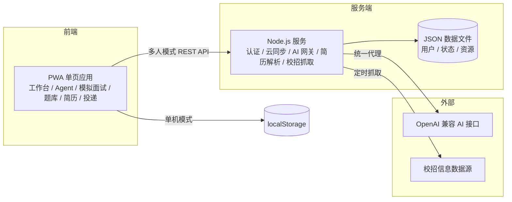
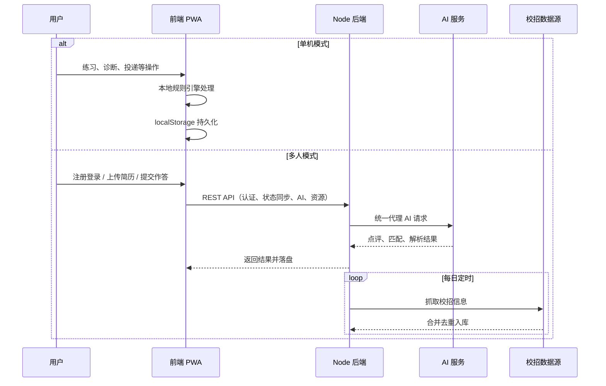
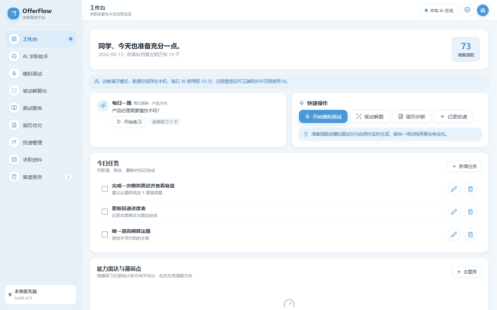
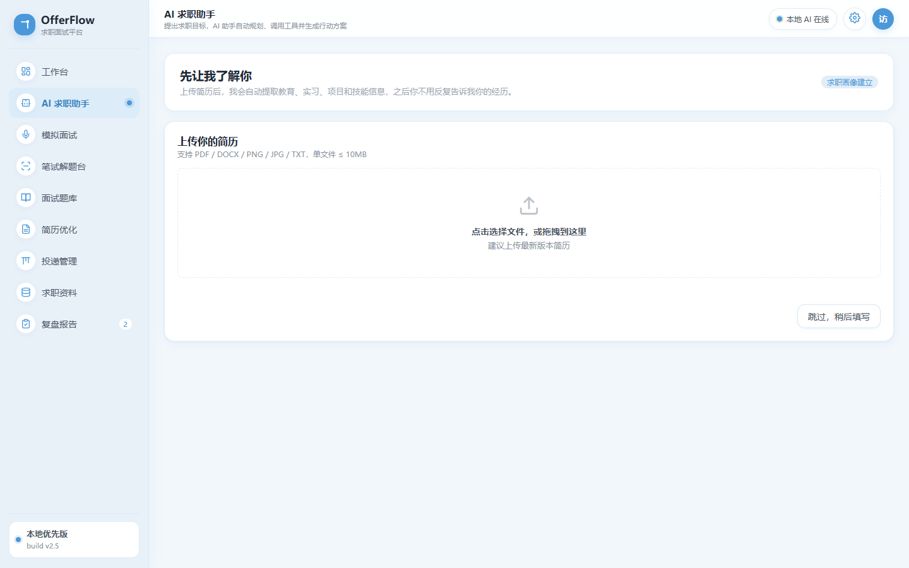
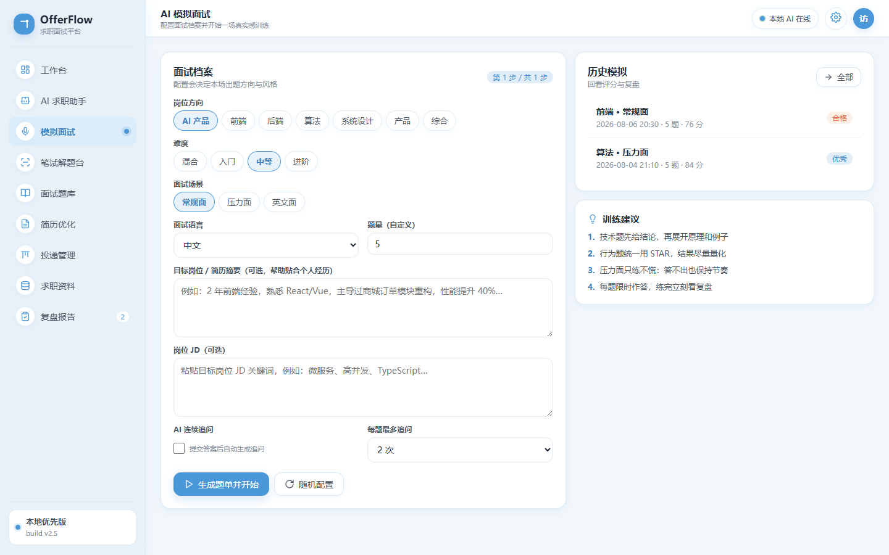
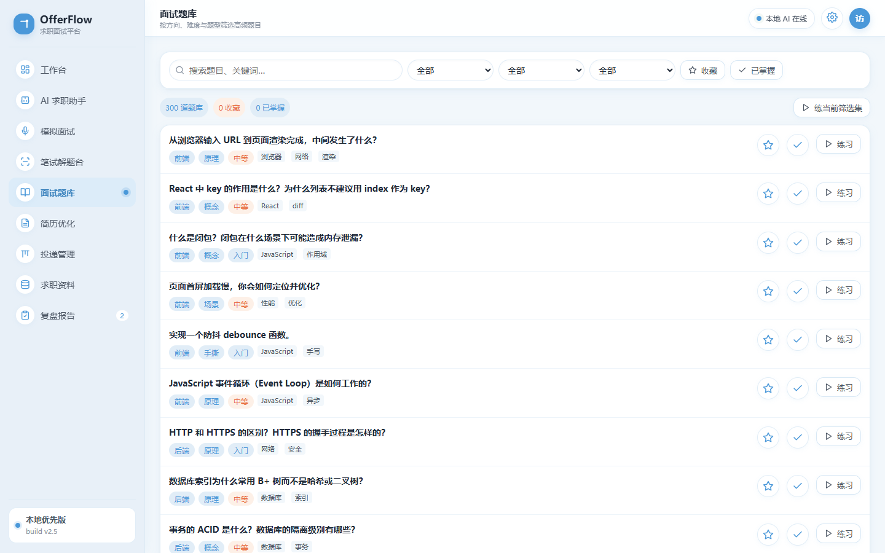
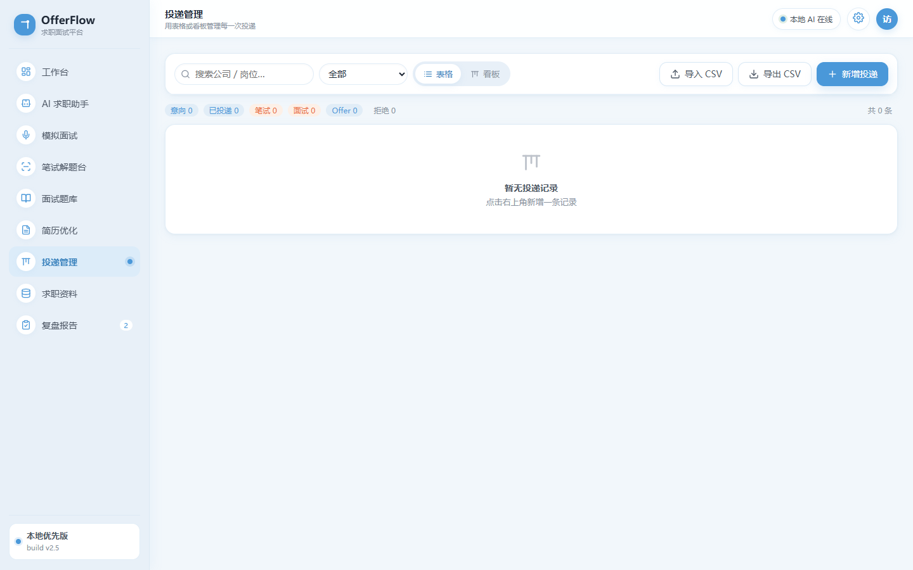

# OfferFlow 智能求职面试平台

面向 AI 产品经理求职者的全流程训练与管理平台，覆盖岗位信息收集、简历优化、题库练习、模拟面试、投递管理、复盘报告与能力成长闭环，支持本地单机与多人云端两种使用形态。

## 项目背景

校招求职者在准备过程中普遍面临四类问题：

- 信息分散：校招、实习、国央企信息散落在不同渠道，投递进度难以追踪。
- 训练低效：缺少面向 AI 产品经理的高质量题库和真实感模拟面试。
- 反馈缺失：面试结束后缺乏结构化复盘，难以定位薄弱能力。
- 简历盲目：不清楚简历与目标 JD 的真实匹配度，缺少可执行的优化建议。

OfferFlow 先把这些分散能力整合为完整求职工作台，再升级为「目标驱动」的 AI 求职 Agent：用户只需提出求职目标，Agent 会自主拆解任务、调用工具、读取中间结果并生成训练计划，而不是让用户在多个模块间自行判断下一步。

## 产品定位

OfferFlow 是一套面向 AI 产品经理求职者的全流程训练与管理平台，核心闭环为：

**信息收集 → 简历优化 → 题库练习 → 模拟面试 → 投递管理 → 面试提醒 → 复盘报告 → 能力成长**

与通用求职工具相比，主要差异：

| 维度 | OfferFlow |
| --- | --- |
| 题库 | 300 道高频题，AI 产品经理方向占比约 53%，答案含标准答案、答题思路、通俗理解与常见追问 |
| 面试训练 | 可自定义题量、方向、难度与场景，支持语音作答、AI 点评与连续追问 |
| 简历诊断 | 本地规则评分 + AI 深度匹配，直接给出可替换的亮点句子与优化建议 |
| 求职管理 | 投递管道、面试日历、提醒、周报与复盘报告一体化 |
| 使用形态 | 本地优先，可单机离线运行，也可多人账号 + 云同步 |

## 功能总述

- 求职工作台：准备指数、今日任务、每日一题、能力雷达、面试日历与倒计时、本周学习报告、投递管道与校招速览。
- AI 求职 Agent：用户提出目标后，Agent 自主规划并调用岗位检索、JD 分析、简历分析、简历匹配、能力诊断、复盘记忆、题目推荐、计划生成等工具；首次使用支持上传简历建立求职画像。未配置大模型时自动降级为本地规则引擎。
- 模拟面试：按方向、难度、场景与语言出题，题量 1-20 可调；提交后展示参考答案与要点，支持语音输入和 AI 连续追问，自动生成复盘报告。
- 笔试解题台：粘贴题目并选择题型，由大模型深度解析或本地引擎给出标准答案、答题思路与举例；内置算法题与 AI 产品案例题。
- 面试题库：300 道高频题（AI 产品经理、基础产品经理、行为题等），支持搜索、筛选、收藏、标记掌握与一键练习。
- 简历优化：粘贴简历与 JD 或载入简历图片，输出本地维度评分、AI 深度匹配分、核心亮点、匹配差距和可直接替换的亮点句子，并支持 AI 改写。
- 投递管理：表格/看板双视图、状态流转、投递链接、面试时间与提醒、CSV 导入导出。
- 求职资料：校招、实习、国央企信息汇总，支持后端每日自动抓取 JSON 数据源、白名单抓取器与手动刷新。
- 复盘与周报：逐题回放、评分详情、独立 HTML 复盘报告，以及每周自动汇总练习、投递、面试与任务数据的 HTML 周报。
- 多人协作：注册登录、用户数据隔离、云端状态同步、访客演示模式；支持 PWA 安装与离线缓存。

## 架构图



## 数据流



## 运行方式

单机模式不需要任何后端，直接用浏览器打开 `index.html`，或启动一个静态服务器：

```bash
python -m http.server 8123
# 访问 http://127.0.0.1:8123/
```

多人模式需要 Node.js 运行环境：

```bash
# Windows
.\scripts\start-local.ps1

# Linux / macOS
bash scripts/start-local.sh
```

首次启动会自动创建 `server/.env.local`（模板见 `server/.env.example`），默认监听 `http://127.0.0.1:8125`。AI 能力默认使用内置本地规则引擎；需要大模型增强时，在环境变量中配置 OpenAI 兼容接口的地址、模型与 Key，多人模式下由后端统一代理，浏览器不接触 Key。

生产部署可参考 `deploy/` 目录提供的 Dockerfile、systemd 服务、Nginx/Caddy 反向代理与备份脚本；建议使用 HTTPS 以完整启用 PWA 能力。仓库内置 `scripts/smoke.js`（前端冒烟测试）与 `scripts/multi-user-test.js`（多人模式测试），改动后可本地回归验证。

## 数据与备份

- 单机模式数据保存在浏览器 `localStorage`（key：`offerflow:v1`），可在设置中重置演示数据。
- 投递记录支持 CSV 导入导出（UTF-8 BOM，Excel 可直接打开）。
- 设置中可导出完整 JSON 备份，支持按 ID 合并导入或整体覆盖恢复。
- 多人模式数据保存在 `server/data/`，密码使用 scrypt 加盐哈希存储；`deploy/backup.sh` 与 `deploy/backup.ps1` 支持每日备份并保留最近 7 份。

## 演示截图











## 路线图

- 已完成：V1 全流程闭环（题库、模拟面试、简历、投递、复盘、周报、多人云同步、PWA）；V2 AI 求职 Agent（首次画像、工具调用、复盘诊断、简历优化、计划生成）及 12 例标准任务评测集。
- 进行中：HTTPS 上线部署、校招数据源接入验证、用户行为埋点。
- 规划中：存储迁移 SQLite、面试录音回放与复盘 PDF 导出、班级/团队空间与榜单、Agent 基于复盘结果动态调整训练计划。

## 项目结构

```text
OfferFlow/
├── index.html                  PWA 应用入口
├── css/                        样式
├── js/                         前端页面、题库、本地引擎与 Agent 引擎
├── server/                     Node 后端（认证、云同步、AI 网关、简历解析、校招抓取）
├── scripts/                    本地启动与自动化测试脚本
├── deploy/                     Docker、systemd、Nginx、Caddy 与备份脚本
├── docs/                       产品文档与演示截图
├── PRD.md                      产品需求文档
└── OfferFlow_V2_Agent_产品方案.md  V2 Agent 产品方案
```
